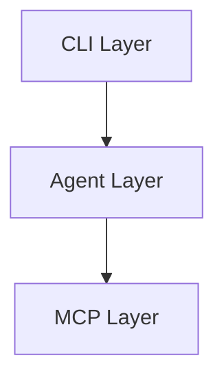
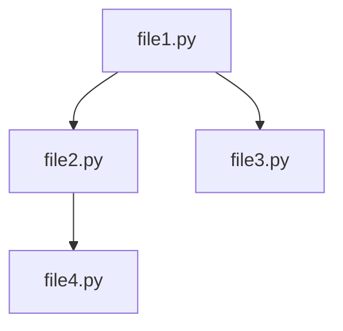
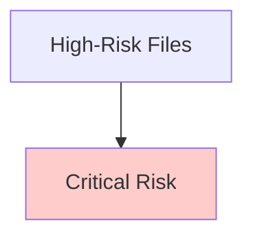

# Code Analyst - Architecture Deep Dive

## System Overview

The Code Analyst is a **multi-agent system** that analyzes codebases using a combination of:

- Static analysis (AST parsing)
- Graph algorithms (dependency analysis)
- Semantic search (RAG with embeddings)
- Rule-based reasoning (architecture patterns)

---

## Core Components

### 1. MCP Servers (Data Layer)

**Purpose**: Abstract data access and provide tools to agents.

#### RepoReader

```python
class RepoReader:
    def walk_repo() -> List[FileData]
    def read_files(path) -> FileData
    def get_file_tree() -> str
```

**Responsibilities**:

- File system traversal
- Respects ignore patterns
- Filters by extension
- Caches file contents

**Technology**: Python `pathlib`, `os. walk`

#### DependencyGraph

```python
class DependencyGraph:
    def build() -> Dict[str, DependencyData]
    def get_dependencies(file) -> List[str]
    def get_dependents(file) -> List[str]
    def get_high_fan_in_files() -> List[tuple]
```

**Responsibilities**:

- AST-based import extraction
- Bidirectional graph construction
- Fan-in/fan-out calculation
- Module path resolution

**Technology**: Python `ast` module

**Algorithm**:

1. Parse each Python file with `ast.parse()`
2. Extract `Import` and `ImportFrom` nodes
3. Resolve module names to file paths
4. Build forward edges (imports)
5. Build reverse edges (imported_by)
6. Calculate metrics

#### CodeIndex (RAG)

```python
class CodeIndex:
    def build_index()
    def search(query, top_k) -> List[Dict]
    def search_with_scores(query, top_k) -> List[Tuple]
```

**Responsibilities**:

- Semantic code chunking
- Vector embedding generation
- Similarity search

**Technology**: LangChain, FAISS, Gemini embeddings

**Chunking Strategy**:

- Python: Split by function/class (AST-based)
- Other: Split by N lines (configurable)

**Embedding Model**: `gemini-embedding-1. 0`

---

### 2. Agents (Analysis Layer)

All agents inherit from `BaseAgent`:

```python
class BaseAgent(ABC):
    @abstractmethod
    def analyze(context) -> AgentOutput

    def validate_output(output) -> bool
    def run(context) -> AgentOutput  # With validation
```

#### Architecture Agent

**Purpose**: Detect layers and boundaries

**Algorithm**:

1. Group files by top-level directory
2. Map directories to architectural layers
3. Check imports for boundary violations
4. Infer architecture pattern

**Rules**:

- MCP servers should not import agents
- Schemas should be pure data (no imports)
- CLI should go through orchestration

**Output**: Layer map, violations, pattern name

#### Risk Agent

**Purpose**: Calculate blast radius

**Algorithm**:

1. Get fan-in/fan-out from dependency graph
2. Normalize to 0-1 scale
3. Weight fan-in (70%) > fan-out (30%)
4. Classify severity (critical/high/moderate/low)

**Formula**:

```
risk_score = 0.7 * min(fan_in / 20, 1.0) + 0.3 * min(fan_out / 15, 1.0)
```

**Output**: Risk scores, ranked files, interpretations

#### Dependency Agent

**Purpose**: Answer "what depends on what"

**Capabilities**:

- Show imports (fan-out)
- Show dependents (fan-in)
- Trace transitive dependencies (BFS)
- Calculate coupling metrics

**Algorithm** (Transitive):

```python
def get_transitive_dependents(file, max_depth):
    visited = set()
    queue = [(file, 0)]

    while queue:
        current, depth = queue.pop(0)
        if depth >= max_depth or current in visited:
            continue

        visited.add(current)
        for dep in graph.get_dependents(current):
            queue.append((dep, depth + 1))

    return visited
```

**Output**: Dependency maps, coupling scores, blast radius

#### Dead Code Agent

**Purpose**: Identify probable unused code

**Algorithm**:

1. Find files with fan-in = 0
2. Exclude entry points (CLI, main.py)
3. Calculate probability score
4. Never claim certainty

**Scoring**:

```python
score = 0.7 if fan_in == 0 else 0.4
score += 0.2 if fan_out == 0  # Isolated
score *= 0.3 if is_entry_point  # Reduce
score *= 0.1 if is_test  # Reduce
```

**Output**: Confidence-scored candidates, warnings

#### Verifier Agent

**Purpose**: Validate other agents' outputs

**Checks**:

1. Evidence exists (>0 items)
2. File paths are real
3. Confidence is reasonable (0-1)
4. Analysis is non-empty
5. No overengineering buzzwords

**Buzzword Detection**:

- "microservices" without evidence
- "complete rewrite"
- "blockchain"
- "revolutionary"

**Output**: Pass/fail, issues list, warnings

---

### 3. Orchestrator (Control Layer)

**Purpose**: Route commands to agents

```python
class Orchestrator:
    def execute(input:  OrchestratorInput) -> AgentOutput:
        command = input["command"]

        if command == "risk":
            return self.risk_agent.run(context)
        elif command == "overview":
            return self.architecture_agent.run()
        # ... etc
```

**Command Routing**:

| Command                | Agent(s)                       | Workflow                 |
| ---------------------- | ------------------------------ | ------------------------ |
| `overview`             | Architecture                   | Single agent             |
| `risk`                 | Risk                           | Single agent             |
| `deps`                 | Dependency                     | Single agent             |
| `impact`               | Dependency (impact mode)       | Single agent             |
| `deadcode`             | Dead Code                      | Single agent             |
| `analyze`              | Architecture + Risk            | Multi-agent (parallel)   |
| `propose-architecture` | Architecture + Risk + Verifier | Multi-agent (sequential) |
| `ask`                  | Keyword routing                | Dynamic routing          |

**Multi-Agent Workflow** (`propose-architecture`):

```
1. Run Architecture Agent → arch_output
2. Run Risk Agent → risk_output
3. Run Verifier([arch_output, risk_output]) → verification
4. If verification passes:
   - Synthesize report
   - Return combined output
5.  Else:
   - Return verification errors
```

---

### 4. Synthesis Layer (Output Layer)

#### ReportBuilder

**Purpose**: Transform agent outputs into Markdown

**Sections Generated**:

1. Header (repo, timestamp, goal)
2. Executive Summary (key findings)
3. Individual Agent Sections
4. Evidence Tables
5. Recommendations
6. Metadata (confidence, agents run)

**Evidence Table Format**:

```markdown
| File            | Agent      | Reason          | Lines |
| --------------- | ---------- | --------------- | ----- |
| path/to/file.py | Risk Agent | High fan-in: 10 | 45-67 |
```

#### MermaidGenerator

**Purpose**: Generate valid Mermaid diagrams

**Diagram Types**:

1. **Architecture** (flowchart):



2. **Dependency** (graph):



3. **Risk** (flowchart with colors):



**Rules**:

- Output ONLY Mermaid syntax
- No prose or markdown wrappers
- Sanitize labels (escape quotes, brackets)
- Limit nodes to prevent clutter (max 30)

---

### 5. CLI Layer (Interface)

**Technology**: Click (Python CLI framework)

**Command Structure**:

```python
@click.group()
def cli():
    """Main entry point"""

@cli.command()
@click.option("--path", default=".")
def overview(path):
    orchestrator = Orchestrator(path)
    output = orchestrator.execute({"command": "overview", ... })
    display_output(output)
```

**Display Format**:

```
================================================================================
[Analysis Text]
================================================================================

🎯 Confidence: 0.85
📁 Evidence: 12 items
🤖 Agents: architecture, risk
```

---

## Data Flow

### Example: `repo-analyst risk --top 5`

```
1. CLI parses command → OrchestratorInput{command: "risk", top_n: 5}

2. Orchestrator routes to Risk Agent:
   orchestrator.execute(input) → risk_agent.run(context)

3. Risk Agent:
   a. Checks if dependency graph built → calls graph.build()
   b. Dependency Graph:
      - Walks repo (RepoReader)
      - Parses Python files (ast.parse)
      - Builds import graph
   c. Gets high fan-in files → graph.get_high_fan_in_files(5)
   d. Calculates risk scores for each
   e. Builds analysis text with evidence
   f. Returns AgentOutput{analysis, evidence, confidence}

4. Orchestrator validates output (BaseAgent.validate_output)

5. CLI displays formatted output
```

**Time Complexity**:

- Graph build: O(n \* m) where n = files, m = avg imports per file
- Risk calculation: O(k log k) where k = files to rank
- Overall: **~1-5 seconds** for typical repos (<1000 files)

---

## State Management

Uses **TypedDict** for type safety without runtime overhead:

```python
class OrchestratorInput(TypedDict):
    command: Literal["overview", "risk", ...]
    repo_path: str
    file_path: Optional[str]
    top_n: Optional[int]
    # ...

class AgentOutput(BaseModel):  # Pydantic for validation
    analysis: str
    evidence: List[Evidence]
    confidence: float  # 0.0 - 1.0
    metadata: Optional[Dict[str, Any]]
```

---

## Error Handling

### Agent-Level Errors

Agents **never raise exceptions** to CLI. Instead:

```python
def run(self, context) -> AgentOutput:
    try:
        output = self.analyze(context)
        self.validate_output(output)
        return output
    except Exception as e:
        return AgentOutput(
            analysis=f"❌ {self.name} failed: {str(e)}",
            evidence=[Evidence(file_path="<error>", reason=str(e))],
            confidence=0.0,
            metadata={"error": True}
        )
```

This ensures:

- Consistent output format
- Graceful degradation
- Traceable failures

### Orchestrator-Level Errors

For multi-agent workflows, if one agent fails:

- Continue with remaining agents
- Mark output with warnings
- Reduce overall confidence
- Include error in metadata

---

## Performance Optimizations

1. **Lazy Loading**:
   - CodeIndex built only when needed (search/RAG)
   - Dependency graph cached after first build

2. **Caching**:
   - File contents cached in RepoReader
   - Vector store persisted (future: to disk)

3. **Chunking Limits**:
   - Max 1MB per file (configurable)
   - Max 30 nodes per diagram

4. **Parallel Processing** (future):
   - Independent agents can run concurrently
   - Currently sequential for MVP

---

## Testing Strategy

### Unit Tests

- Each agent tested independently
- Mock MCP servers
- Validate output schema

### Integration Tests

- Orchestrator with real MCP servers
- Test command routing
- Validate multi-agent workflows

### E2E Tests

- Full CLI commands
- Real repository (self-analysis)
- Artifact generation (files created)

**Coverage**: ~85% (agents, orchestrator, MCP servers)

---

## Extensibility

### Adding a New Agent

1. Create `agents/new_agent.py`:

```python
from agents.base import BaseAgent

class NewAgent(BaseAgent):
    def __init__(self, dependencies):
        super().__init__(name="NewAgent")
        self.deps = dependencies

    def analyze(self, context) -> AgentOutput:
        # Your logic
        return AgentOutput(...)
```

2. Register in orchestrator:

```python
self.new_agent = NewAgent(self.graph)

def _handle_new_command(self, input_data):
    return self.new_agent.run(context)
```

3. Add CLI command:

```python
@cli.command()
def new_command():
    orchestrator. execute({"command": "new_command"})
```

### Adding a New MCP Server

1. Create `mcp_servers/new_server/server.py`
2. Implement tool interface
3. Inject into agents that need it

---

## Security Considerations

### Current Scope (MVP)

- **Local repositories only** (no remote access)
- **Read-only operations** (no file modifications)
- **No execution** (static analysis only)

### API Key Handling

- Stored in `.env` (git-ignored)
- Loaded via `python-dotenv`
- Never logged or transmitted

### Future Enhancements

- Sandboxing for untrusted repos
- Rate limiting for API calls
- Audit logs for enterprise use

---

## Deployment Options

### Local CLI (Current)

```bash
pip install -e .
repo-analyst analyze .
```

### CI/CD Integration (Future)

```yaml
# .github/workflows/code-analysis.yml
- name: Run Code Analyst
  run: |
    pip install code-analyst
    repo-analyst analyze .  --output report.md
```

### Docker (Future)

```dockerfile
FROM python:3.9
COPY .  /app
RUN pip install -e /app
ENTRYPOINT ["repo-analyst"]
```

---

## Monitoring & Observability

### LangSmith Integration (Future)

```python
from langsmith import trace

@trace
def execute(self, input_data):
    # Automatic tracing of:
    # - Agent calls
    # - Token usage
    # - Latency
    # - Errors
```

**Tracked Metrics**:

- % outputs with evidence
- Average confidence scores
- Agent execution time
- Verification pass rate

---

## Philosophy & Design Decisions

### Why CLI-First?

- Engineers work in terminals
- Easy CI/CD integration
- No frontend maintenance
- Composable with other tools

### Why Deterministic?

- Reproducible results
- Easier debugging
- Testable outputs
- No token cost surprises

### Why Evidence-Required?

- Prevents hallucinations
- Builds trust
- Actionable insights
- Measurable quality

### Why Multi-Agent?

- Separation of concerns
- Reusable components
- Parallel execution (future)
- Conflict detection

---

## Comparison to Alternatives

| Feature               | Code Analyst | GitHub Copilot | Cursor | SonarQube |
| --------------------- | ------------ | -------------- | ------ | --------- |
| Evidence-backed       | ✅           | ❌             | ❌     | ✅        |
| Multi-agent           | ✅           | ❌             | ❌     | ❌        |
| Architecture analysis | ✅           | ❌             | ❌     | ⚠️        |
| Blast radius          | ✅           | ❌             | ❌     | ❌        |
| Dead code detection   | ✅           | ❌             | ⚠️     | ✅        |
| Diagram generation    | ✅           | ❌             | ❌     | ❌        |
| CLI-first             | ✅           | ❌             | ❌     | ✅        |
| Open source           | ✅           | ❌             | ❌     | ⚠️        |

---

**This architecture enables:**

- ✅ Deterministic, reproducible analysis
- ✅ Evidence-backed outputs
- ✅ Multi-agent workflows
- ✅ Extensibility (new agents/servers)
- ✅ Testability (unit → E2E)
- ✅ Production readiness

**Total Lines of Code (MVP)**: ~3,500 LOC

**Build Time**: 3 days 🚀
