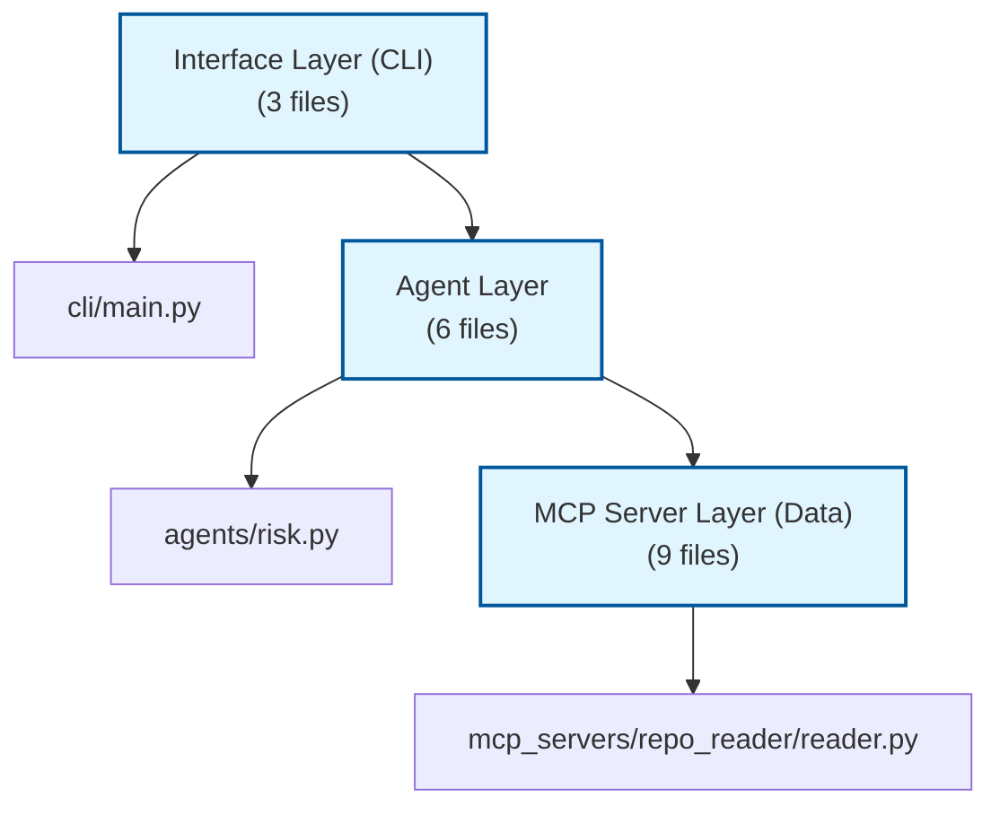

# Code Analyst - Example Commands & Outputs

## Example 1: Quick Health Check

**Command:**

```bash
repo-analyst analyze .
```

**Output:**

```
🔍 Analyzing repository:  .

🔧 Initializing MCP servers for:  /home/user/code-analyst
✅ Orchestrator ready

🎯 Executing command: analyze

📊 Running Full Analysis (Architecture + Risk)
🏗️ Running Architecture Agent
🔨 Building dependency graph...
✅ Graph built:  26 files analyzed

🔍 Running Risk Agent (top_n=5)

================================================================================
**Architecture Analysis**

**Detected Layers**:  5

- **Interface Layer (CLI)**: 3 files
- **Agent Layer**: 6 files
- **Orchestration Layer**: 2 files
- **MCP Server Layer (Data)**: 9 files
- **Schema Layer (Shared)**: 2 files

**Architecture Pattern**: Layered Architecture with Agent Pattern

✅ **No boundary violations detected**

---

**Top 5 High-Risk Files**

1. `mcp_servers/repo_reader/reader.py` — Risk:  0.26, Dependents: 7
2. `mcp_servers/dependency_graph/graph.py` — Risk: 0.18, Dependents: 4
3. `schemas/base.py` — Risk: 0.17, Dependents: 5

================================================================================

🎯 Confidence:  0.88
📁 Evidence: 24 items
🤖 Agents:  architecture, risk
```

---

## Example 2: Dead Code Detection

**Command:**

```bash
repo-analyst deadcode --threshold 0.7 --top 10
```

**Output:**

```
💀 Dead Code Detection (threshold:  0.7)

🔧 Initializing MCP servers...
✅ Orchestrator ready

🎯 Executing command: deadcode
💀 Running Dead Code Agent (threshold=0.7)
🔨 Building dependency graph...
✅ Graph built: 26 files analyzed

================================================================================
**⚠️ Probable Dead Code Detection**

Found **3 file(s)** with low usage (threshold: 0.7)

**IMPORTANT**: These are probabilistic findings. Always verify before deletion.

🔴 **High Confidence** (2 files):
  - `tests/old_test.py` (score: 0.90, fan-in: 0, fan-out: 0)
  - `scripts/deprecated. py` (score: 0.85, fan-in: 0, fan-out: 1)

🟡 **Medium Confidence** (1 files):
  - `utils/legacy. py` (score: 0.72, fan-in: 0, fan-out: 2)

**Recommendations**:
1. Verify each file manually before deletion
2. Check for runtime imports (not detected by static analysis)
3. Look for entry points (CLI commands, scripts)
4. Consider if files are used by external tools
================================================================================

🎯 Confidence: 0.70
📁 Evidence: 3 items

📊 Statistics:
  High confidence: 2
  Medium confidence: 1
```

---

## Example 3: Change Impact Analysis

**Command:**

```bash
repo-analyst impact agents/base.py --depth 3
```

**Output:**

```
💥 Change Impact Analysis:  agents/base.py

🔧 Initializing MCP servers...
✅ Orchestrator ready

🎯 Executing command: impact
💥 Running Impact Analysis for: agents/base.py
🔨 Building dependency graph...
✅ Graph built: 26 files analyzed

================================================================================
**Change Impact Analysis for `agents/base.py`**

**Direct impact**: 5 files
**Total blast radius** (depth 3): 12 files

**Severity**:  🟡 MEDIUM

**Files potentially affected:**
  - `agents/risk.py`
  - `agents/architecture.py`
  - `agents/dependency. py`
  - `agents/dead_code.py`
  - `agents/verifier.py`
  - `cli/main.py`
  - `graph/orchestrator.py`
  - ... and 5 more

⚠️ **Recommendation**:  Changes to this file require testing 12 dependent files.
================================================================================

🎯 Confidence: 0.95
📊 Blast Radius: 12 files
```

---

## Example 4: Architecture Proposal

**Command:**

```bash
repo-analyst propose-architecture \
  --goal "Prepare for microservices migration" \
  --output migration-plan.md
```

**Output:**

```
🏗️ Architecture Proposal

Goal: Prepare for microservices migration

🔧 Initializing MCP servers...
✅ Orchestrator ready

🎯 Executing command: propose-architecture

🏗️ Multi-Agent Architecture Proposal
Goal: Prepare for microservices migration

Step 1/3: Analyzing architecture...
🏗️ Running Architecture Agent
🔨 Building dependency graph...
✅ Graph built: 26 files analyzed

Step 2/3: Analyzing risks...
🔍 Running Risk Agent (top_n=10)

Step 3/3: Verifying outputs...
✅ Running Verifier Agent

Synthesizing report...

✅ Report saved to: migration-plan.md

🎯 Confidence: 0.88
📁 Evidence: 31 items
🤖 Agents: architecture, risk, verifier
✅ Verification:  PASSED
```

---

## Example 5: Natural Language Query

**Command:**

```bash
repo-analyst ask "If I change the dependency graph, what will break?"
```

**Output:**

```
❓ Question: If I change the dependency graph, what will break?

🔧 Initializing MCP servers...
✅ Orchestrator ready

🎯 Executing command: ask
❓ Processing question: If I change the dependency graph, what will break?
→ Routing to Impact Analysis for mcp_servers/dependency_graph/graph.py

💥 Running Impact Analysis...
🔨 Building dependency graph...
✅ Graph built: 26 files analyzed

================================================================================
**Change Impact Analysis for `mcp_servers/dependency_graph/graph.py`**

**Direct impact**: 4 files
**Total blast radius** (depth 3): 18 files

**Severity**: 🔴 HIGH

**Files potentially affected:**
  - `agents/risk.py`
  - `agents/architecture.py`
  - `agents/dependency.py`
  - `agents/dead_code.py`
  - `graph/orchestrator.py`
  - `cli/main.py`
  - ...  and 12 more

⚠️ **Recommendation**: Changes to this file require testing 18 dependent files.

This is a critical infrastructure file.  Consider:
1. Adding comprehensive unit tests
2. Feature flags for gradual rollout
3. Backward compatibility layer
================================================================================

🎯 Confidence: 0.95
📁 Evidence: 18 items
```

---

## Example 6: Mermaid Diagram Generation

**Command:**

```bash
repo-analyst diagram --type architecture --output architecture.mmd
```

**Output:**

```
🎨 Generating architecture diagram...

🔧 Initializing MCP servers...
✅ Orchestrator ready

🎨 Generating architecture diagram...
🏗️ Running Architecture Agent
🔨 Building dependency graph...
✅ Graph built: 26 files analyzed

✅ Diagram saved to: architecture.mmd
💡 View at: https://mermaid.live
```

**File content (architecture.mmd):**



---

## Example 7: Dependency Investigation

**Command:**

```bash
repo-analyst deps agents/risk.py
```

**Output:**

```
🔗 Dependency Analysis:  agents/risk.py

🔧 Initializing MCP servers...
✅ Orchestrator ready

🎯 Executing command: deps
🔗 Running Dependency Agent for: agents/risk.py
🔨 Building dependency graph...
✅ Graph built: 26 files analyzed

================================================================================
**Dependency Analysis for `agents/risk.py`**

**Dependencies** (what this imports): 2
**Dependents** (what imports this): 3

**Imports:**
  - `agents/base.py`
  - `mcp_servers/dependency_graph/graph.py`

**Imported by:**
  - `cli/main.py`
  - `graph/orchestrator.py`
  - `agents/test_risk.py`

**Metrics:**
  - Fan-in: 3, Fan-out: 2
  - Coupling: 0.20/1.0

🟢 **Low coupling**:  This file is relatively isolated.
================================================================================

🎯 Confidence: 1.00
```

---

## Example 8: Semantic Code Search

**Command:**

```bash
repo-analyst search "evidence validation" --top 3
```

**Output:**

```
🔍 Searching for:  'evidence validation'

🔨 Building code index...
Chunked into 89 code blocks.
Generating embeddings (this may take a while)...
✅ Code index built Successfully.

================================================================================

📄 Result 1:
  File: agents/base.py
  Lines: 24-52
  Name: validate_output

  Code Preview:
  def validate_output(self, output:  AgentOutput) -> bool:
        """
        Validate agent output before returning.

        Rules:
        - Must have non-empty analysis
        - Must have at least one piece of evidence
        - Confidence must be between 0 and 1
        ...
--------------------------------------------------------------------------------

📄 Result 2:
  File: agents/verifier.py
  Lines: 45-78
  Name: _verify_output

  Code Preview:
  def _verify_output(
        self, output: AgentOutput, strict_mode: bool
    ) -> Dict[str, Any]:
        """Verify a single agent output"""
        issues = []
        warnings = []

        # Check 1: Evidence exists
        if not output.evidence or len(output.evidence) == 0:
        ...
--------------------------------------------------------------------------------
```

---

These examples demonstrate the full capabilities of the Code Analyst MVP!
